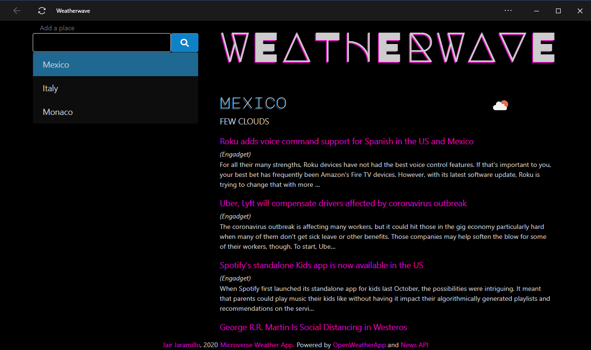

<br />
<p align="center">
  <a href="https://www.microverse.org/">
  
  </a>
</p>

<center><h1>Microverse 605: Weather App</h1></center>

<center><h2><a href="https://raw.githack.com/rmauritsson/todo-list/feature/logic/dist/index.html">Check a live version of this project</a><h2></center>

## About The Project

This project is a Todo web app that allows you to make To-Dos type of notes, create as many projects as you want to put more To-Dos in them. You can edit and delete them.

<p align="center">
  
</p>

### Built With

This progam was made using this technologies

* [Javascript](https://www.javascript.com/)
* [Node JS](https://nodejs.org/en/)
* [NPM](https://www.npmjs.com/)
* [Bootstrap](https://getbootstrap.com/)
* [Stickler](https://stickler-ci.com/)

## Getting Started
To get a local copy up and running follow these simple example steps:

### Prerequisite Instalations
* Git
* Nodejs
* NPM

If you're using an Ubuntu Linux Distribution or derivate, you can install these programs by using these commands in your Linux Terminal:

```sh
sudo apt update
sudo apt install git
curl -sL https://deb.nodesource.com/setup_13.x | sudo -E bash -
sudo apt-get install -y nodejs
```

* If you're using Microsoft Windows, the Git installer can be found [here](https://gitforwindows.org/), and Node JS/NPM installer can be found [here](https://nodejs.org/en/download/).
* If you have another type of Linux Distribution, you can check how to install Node JS and NPM by checking [this article](https://nodejs.org/en/download/package-manager/).

### Installation

Clone this GitHub repository:
```sh
git clone https://github.com/rmauritsson/todo-list.git
```
Go to the repository folder and install the NPM modules:

```sh
npm install
npm install --save-dev webpack webpack-cli
```

Then, generate the main.js file by using webpack.

```sh
npx webpack --mode=development
```
For development mode, and:

```sh
npx webpack --mode=production
```
For production.
## Usage

The To-Do program needs a container on your DOM with the id 'container' in order to append the interface and generate the Project List object.

If you want to test the web app, create an index.html file inside the dist/ directory and add the main.js script, along with bootstrap. Then add a 'div' element in the body with the 'container' id tag:

```html
<!DOCTYPE html>
<html lang="en" dir="ltr">
  <head>
    <meta charset="utf-8">
    <meta name="viewport" content="width=device-width, maximum-scale=1, initial-scale=1, user-scalable=0">
    <title>Todo List</title>
    <link rel="stylesheet" href="https://stackpath.bootstrapcdn.com/bootstrap/4.4.1/css/bootstrap.min.css">
  </head>
  <body>
    <div id="container" class="container"></div>

    <script src="https://code.jquery.com/jquery-3.2.1.slim.min.js"></script>
    <script src="https://cdnjs.cloudflare.com/ajax/libs/popper.js/1.12.9/umd/popper.min.js"></script>
    <script src="https://maxcdn.bootstrapcdn.com/bootstrap/4.0.0/js/bootstrap.min.js"></script>
    <script src="main.js" defer></script>
  </body>
</html>
```

Then just open the index.html file on your browser.

## License

Distributed under the MIT License. See `LICENSE` for more information.

<!-- CONTACT -->

## Contact

* Leonard Rwai Kanyesigye: [Github](https://github.com/rmauritsson), [Twitter](https://twitter.com/leokanye)

* Jair Jaramillo: [Github](https://github.com/jairjy), [Twitter](https://twitter.com/jairjy)

Project Link: [https://github.com/rmauritsson/todo-list](https://github.com/rmauritsson/todo-list)

<!-- ACKNOWLEDGEMENTS -->

## Acknowledgements

* [Microverse](https://www.microverse.org/)
* [The Odin Project](https://www.theodinproject.com/)
* [W3Schools](https://www.w3schools.com/)
